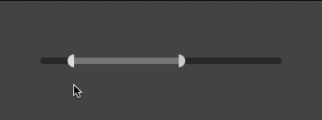

# HRangeSlider

A slider that goes from left (`min_value`) to right (`max_value`), used to adjust a range by moving grabbers along a horizontal axis.

### Properties

| Property | Description |
|---|---|
| `start_value: float` | `HRangeSlider`'s start value. |
| `end_value: float` | `HRangeSlider`'s end value. |
| `min_value: float` | Minimum value (left). |
| `max_value: float ` | Maximum value (right). |
| `step: float` | `start_value` and `end_value` is snapped to a multiple of this value. |
| `tick_count: int` | Number of ticks displayed including border ticks. |
| `ticks_on_borders: bool` | Display ticks for minimum and maximum values. |
| `allow_greater: bool` | Allow that `end_value` may be greater than `max_value`. |
| `allow_lesser: bool` | Allow that `start_value` may be less than `min_value`. |
| `editable: bool` | Allows to interact with the slider. |

### Signals

| Signal | Description |
|---|---|
| `changed()` | Emitted when `min_value`, `max_value`, or `step` changes. |
| `value_changed(start_value: float, end_value: float)` | Emitted when `start_value` or `end_value` changes. |
| `drag_started()` | Emitted when dragging of an element starts. This is emitted before the corresponding `value_changed()` signal. |
| `drag_ended(value_changed: bool)` | Emitted when dragging of an element ends. If `value_changed` is true, `start_value` or `member end_value` is different from the value when dragging was started. |

### Theme

The following theme properties can be overidden in a custom theme to change the appearance of the control.

*(inherited): These are properties which are not defined in the default theme (`res://addons/detomon.assorted-controls/theme/theme.tres`), but instead inherit from other controls by default. Add these properties to a custom theme to override them.*

#### Constants

| Name | Description |
|---|---|
| `grabber_drag_margin ` | Margin around grabber to extend hit area. Default: `2`. |
| `grabber_area_drag_margin` | Margin around grabber area to extend hit area. Default: `4`. |

#### Icons

| Name | Description |
|---|---|
| `grabber_low` | Grabber icon for `start_value`. |
| `grabber_low_disabled` | Grabber icon for `start_value` when disabled. |
| `grabber_low_highlight` | Grabber icon for `start_value` when highlighted. |
| `grabber_high` | Grabber icon for `end_value`. |
| `grabber_high_disabled` | Grabber icon for `end_value ` when disabled. |
| `grabber_high_highlight` | Grabber icon for `end_value ` when highlighted. |
| `tick` (inherited) | Tick icon. Default: `HSlider/icons/tick`. |

#### Styles

| Name | Description |
|---|---|
| `slider` (inherited) | Slider box. Default: `HSlider/styles/slider`. |
| `grabber_area` (inherited) | Area drawn between range grabbers. Default: `HSlider/styles/grabber_area `. |
| `grabber_area_highlight` (inherited) | Area drawn between range grabbers when highlighted. Default: `HSlider/styles/grabber_area_highlight`. |
